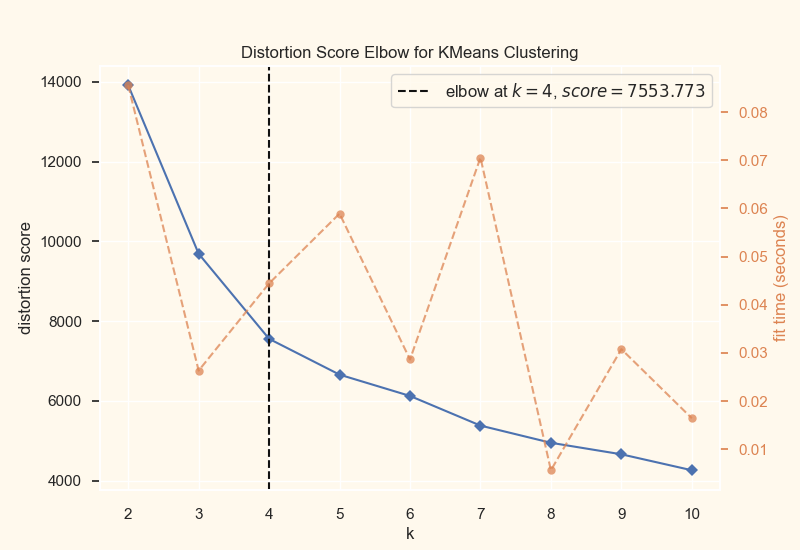
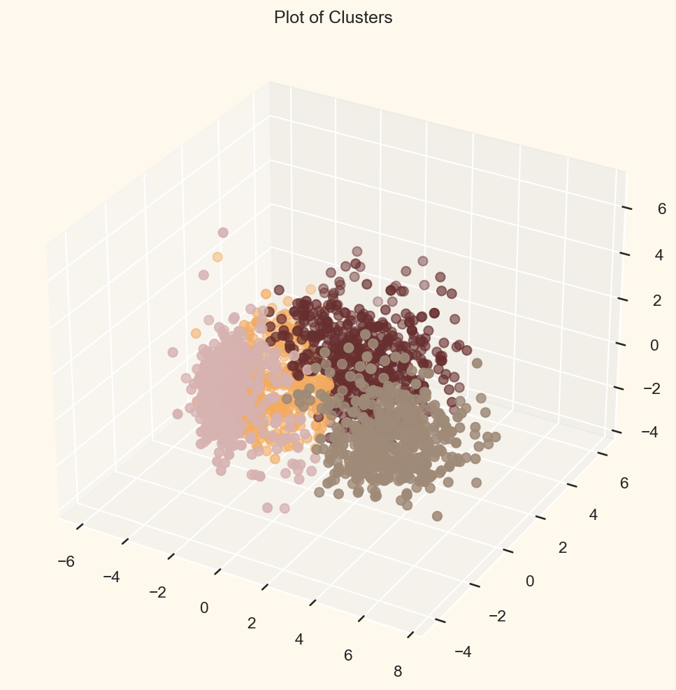
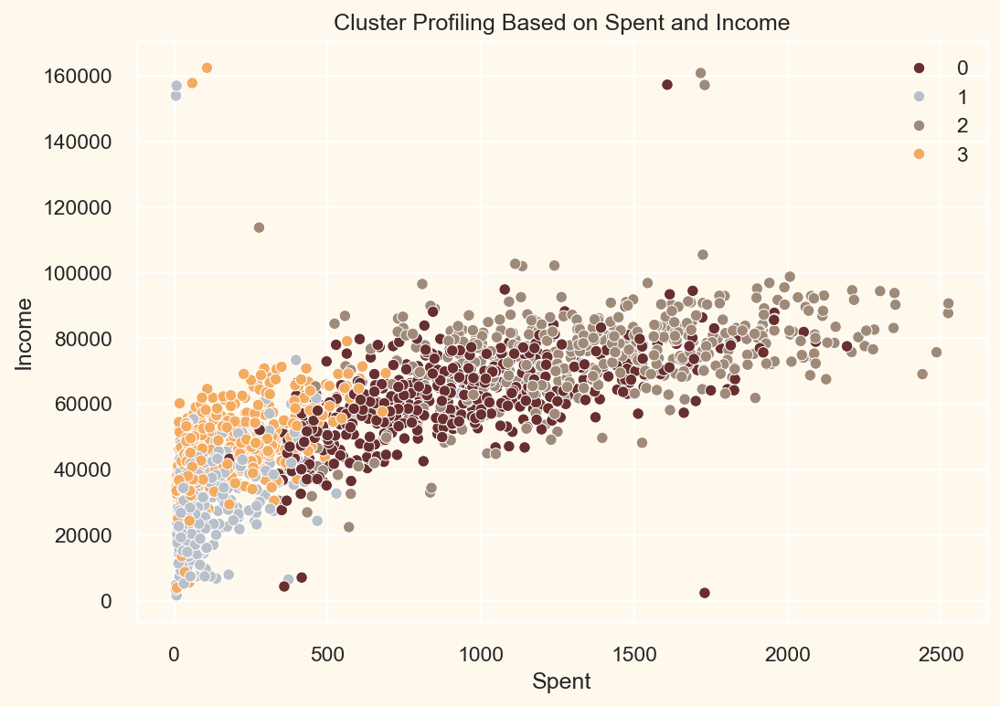

# ML-data-analytics-project

# Customer Segmentation — Marketing Analytics Project

An end-to-end data analytics and machine learning project applying unsupervised learning to segment grocery store customers based on income, spending behavior, and family structure.

Built by following [Lore So What's tutorial](https://www.youtube.com/watch?v=k_7Ise59GQY), adapted for local development in VS Code.

## Project Overview
- **Goal:** Segment customers into groups to inform targeted marketing strategies
- **Dataset:** Marketing campaign data (2,240 customers, 29 original features)
- **Techniques:** Data cleaning, feature engineering, PCA (dimensionality reduction), Agglomerative Clustering

## Tools & Libraries
- Python (pandas, numpy, matplotlib, seaborn)
- scikit-learn (LabelEncoder, StandardScaler, PCA, AgglomerativeClustering)
- yellowbrick (KElbowVisualizer)

## Process
1. **Data Cleaning** — removed nulls, converted dates, capped unrealistic outliers (age, income)
2. **Feature Engineering** — derived Age, total Spend, Family_Size, Is_Parent, and other features from raw columns
3. **Encoding & Scaling** — label-encoded categorical variables, standardized all features
4. **Dimensionality Reduction** — reduced 23 features to 3 principal components using PCA
5. **Clustering** — used the elbow method to determine 4 as the optimal cluster count, then applied Agglomerative Clustering
6. **Cluster Profiling** — analyzed each cluster's income, spending, family structure, and campaign responsiveness to build actionable customer profiles

## Key Findings
Identified four distinct customer groups, ranging from high-income/no-kids premium spenders to budget-conscious, deal-driven families. Full profiles and marketing recommendations are in the notebook.

## Visualizations

### Determining Optimal Clusters (Elbow Method)


### Customer Clusters in 3D


### Income vs. Spending by Cluster



## Repo Structure
```
├── data/           # Marketing campaign dataset
├── notebooks/      # Analysis notebook
├── images/         # Saved visualizations
└── requirements.txt
```